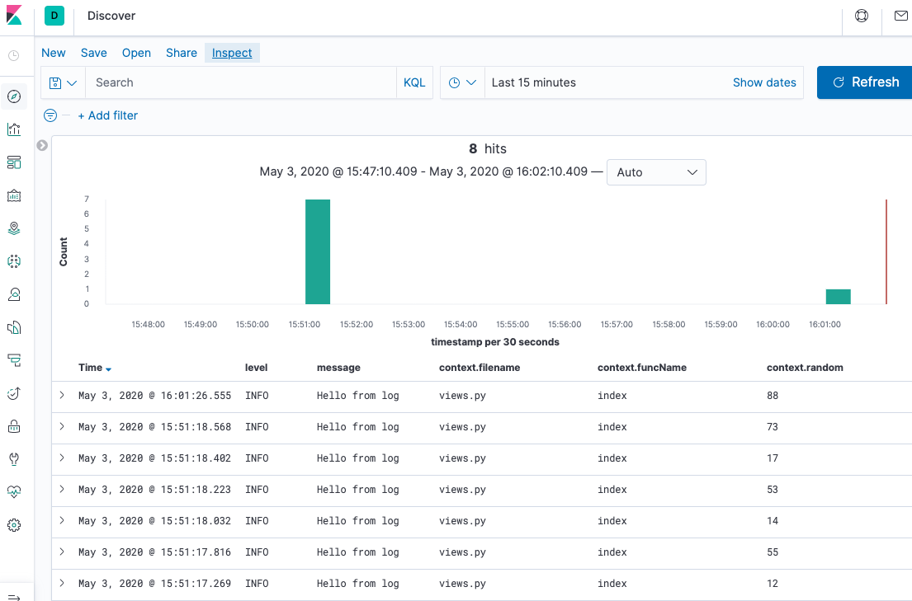
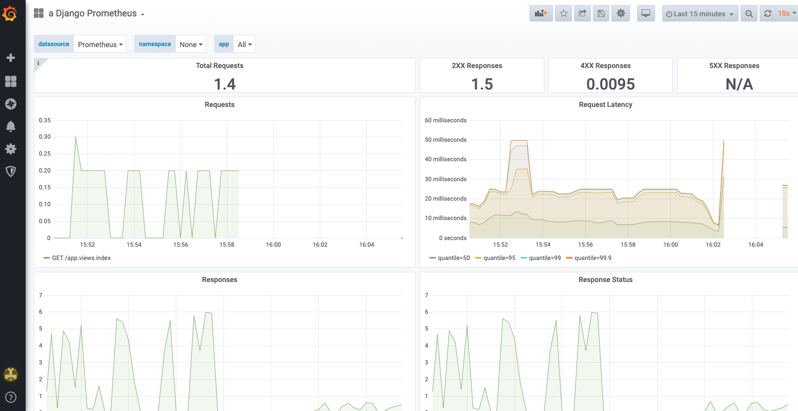

## Monitoring Django applications with Grafana and Kibana using Prometheus and Elasticsearch

When we've one application we need to monitor the logs in one way or another. Not only the server's logs (500 errors, response times and things like that). Sometimes the user complains about the application. Without logs we cannot do anything. We can save logs within files and let grep and tail do the magic. This's assumable with a single on-premise server, but nowadays with clouds and docker this's a nightmare. We need a central log collector to collect all the logs of the application and use this collector to create alerts, and complex searches of our application logs.

I normally work with AWS. In AWS we've CloudWatch. It's pretty straightforward to connect our application logs to CloudWatch when we're using AWS. When we aren't using AWS we can use the ELK stack. In this exaple we're going to send our Django application logs to a Elasticsearch database. Let's start:
 
The idea is not to send the logs directly. The idea save the logs to log files. We can use this LOGGING configuration to do that:

```python
LOGGING = {
    'version': 1,
    'disable_existing_loggers': False,
    'formatters': {
        "json": {
            '()': CustomisedJSONFormatter,
        },
    },
    'handlers': {
        'console': {
            'class': 'logging.StreamHandler',
        },
        'app_log_file': {
            'level': LOG_LEVEL,
            'class': 'logging.handlers.RotatingFileHandler',
            'filename': os.path.join(LOG_PATH, 'app.log.json'),
            'maxBytes': 1024 * 1024 * 15,  # 15MB
            'backupCount': 10,
            'formatter': 'json',
        },
    },
    'root': {
        'handlers': ['console', 'app_log_file'],
        'level': LOG_LEVEL,
    },
}
```

Here I'm using a custom JSON formatter:

```python
import json_log_formatter
import logging
from django.utils.timezone import now


class CustomisedJSONFormatter(json_log_formatter.JSONFormatter):
    def json_record(self, message: str, extra: dict, record: logging.LogRecord):
        extra['name'] = record.name
        extra['filename'] = record.filename
        extra['funcName'] = record.funcName
        extra['msecs'] = record.msecs
        if record.exc_info:
            extra['exc_info'] = self.formatException(record.exc_info)

        return {
            'message': message,
            'timestamp': now(),
            'level': record.levelname,
            'context': extra
        }
```

With this configuration our logs are going to be something like that:

```json
{"message": "Hello from log", "timestamp": "2020-04-26T19:35:59.427098+00:00", "level": "INFO", "app_id": "Logs", "context": {"random": 68, "name": "app.views", "filename": "views.py", "funcName": "index", "msecs": 426.8479347229004}}
```

Now we're going to use logstash as data shipper to send the logs to elastic search. We need to create a pipeline:

```
input {
    file {
        path => "/logs/*"
        start_position => "beginning"
        codec => "json"
    }
}

output {
  elasticsearch {
        index => "app_logs"
        hosts => ["elasticsearch:9200"]
    }
}
```

We're going to use Docker to build our stack, so our logstash and our django containers will share the logs volumes.

Now we need to visualize the logs. Kibana is perfect for this task. We can set up a Kibana server connected to the Elasticsearch and visualize the logs:

 

Also we can monitor our server performance. Prometheus is the de facto standard for doing that. In fact it's very simple to connect our Django application to Prometheus. We only need to add django-prometheus dependency, install the application and set up two middlewares:

```python
INSTALLED_APPS = [
   ...
   'django_prometheus',
   ...
]

MIDDLEWARE = [
    'django_prometheus.middleware.PrometheusBeforeMiddleware', # <-- this one
    'app.middleware.RequestLogMiddleware',
    'django.middleware.security.SecurityMiddleware',
    'django.contrib.sessions.middleware.SessionMiddleware',
    'django.middleware.common.CommonMiddleware',
    'django.middleware.csrf.CsrfViewMiddleware',
    'django.contrib.auth.middleware.AuthenticationMiddleware',
    'django.contrib.messages.middleware.MessageMiddleware',
    'django.middleware.clickjacking.XFrameOptionsMiddleware',
    'django_prometheus.middleware.PrometheusAfterMiddleware', # <-- this one
]
```

also we need to set up some application routes
```python
from django.contrib import admin
from django.urls import path, include

urlpatterns = [
    path('admin/', admin.site.urls),
    path('p/', include('django_prometheus.urls')), # <-- prometheus routes
    path('', include('app.urls'))
]
```

The easiest way to visualize the data stored in prometheus is using Grafana. In Grafana we need to create a datasource with Prometheus and build our custom dashboard. We can import pre-built dashboards. For example this one: https://grafana.com/grafana/dashboards/9528



Here the docker-compose file with all the project:

```yaml
version: '3'
services:
  web:
    image: web:latest
    restart: always
    command: /bin/bash ./docker-entrypoint.sh
    volumes:
      - static_volume:/src/staticfiles
      - logs_volume:/src/logs
    environment:
      DEBUG: 'False'
      LOG_LEVEL: DEBUG

  nginx:
    image: nginx:latest
    restart: always
    volumes:
      - static_volume:/src/staticfiles
    ports:
      - 80:80
    depends_on:
      - web
      - grafana

  prometheus:
    image: prometheus:latest
    restart: always
    build:
      context: .docker/prometheus
      dockerfile: Dockerfile

  grafana:
    image: grafana:latest
    restart: always
    depends_on:
      - prometheus
    environment:
      - GF_SECURITY_ADMIN_USER=${GF_SECURITY_ADMIN_USER}
      - GF_SECURITY_ADMIN_PASSWORD=${GF_SECURITY_ADMIN_PASSWORD}
      - GF_USERS_DEFAULT_THEME=${GF_USERS_DEFAULT_THEME}
      - GF_USERS_ALLOW_SIGN_UP=${GF_USERS_ALLOW_SIGN_UP}
      - GF_USERS_ALLOW_ORG_CREATE=${GF_USERS_ALLOW_ORG_CREATE}
      - GF_AUTH_ANONYMOUS_ENABLED=${GF_AUTH_ANONYMOUS_ENABLED}

  logstash:
    image: logstash:latest
    restart: always
    depends_on:
      - elasticsearch
    volumes:
      - logs_volume:/logs:ro

  elasticsearch:
    image: docker.elastic.co/elasticsearch/elasticsearch:7.5.2
    restart: always
    environment:
      - discovery.type=single-node
      - http.host=0.0.0.0
      - xpack.security.enabled=false
      - ES_JAVA_OPTS=-Xms750m -Xmx750m
    volumes:
      - elasticsearch_volume:/usr/share/elasticsearch/data

  kibana:
    image: kibana:latest
    restart: always
    ports:
      - 5601:5601
    depends_on:
      - elasticsearch
volumes:
  elasticsearch_volume:
  static_volume:
  logs_volume:
  grafana_data:
```

And that's all. Our Django application up and running fully monitored
